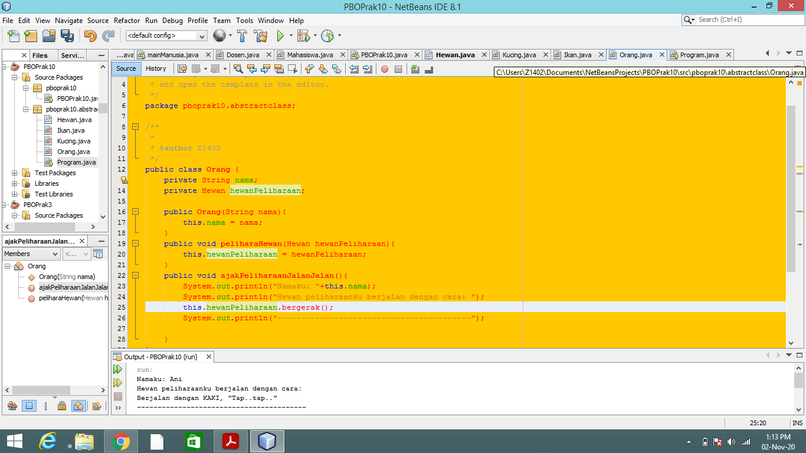

MARKDOWN

LAPORAN PRAKTIKUM

PERTANYAAN

1.	Berikan penjelasan terkait tentang jalannya program diatas 

Jawab : program tersebut menggunakan abstract class yang berarti tidak dapat diinstansiasikan namun dapat di-extend, 
jalan dari program tersebut yaitu pada class Hewan terdapat property dan method biasa namun yang membedakan yaitu terdapat method abstract bernama bergerak() yang tidak dapat dimiliki badan fungsi, 
method tersebut nantinya akan di override oleh class turunan dari class Hewan. Kemudian pada class Kucing dan Ikan berisikan method yang merupakan override dari method bergerak(). 
Lalu terdapat class baru yang bernama Orang yang berfungsi sebagai pengguna class Hewan. Kemudian terdapat class main di akhir untuk menjalankan programnya.

2.	Tunjukkan hasil kompilasi program dan berikan penjelasan singkat jika method bergerak() diubah menjadi method abstract!

Jawab :  hasilnya akan error karena melakukan implementasi extends sehingga tidak perlu menambahkan method abstract apabila menambah method abstract lagi akan terjadi error.

3.	Tunjukkan hasil kompilasi program dan berikan penjelasan singkat jika tidak dilakukan overriding terhadap method bergerak()

Jawab: hasilnya akan error karena tidak terjadi deklarasi dan tidak dapat mewarisi tingkah laku dari parent class.

4.	Tunjukkan hasil kompilasi program dan berikan penjelasan singkat jika abstract method bergerak()yang dideklarasikan dalam Class Ikan

Jawab : hasilnya akan muncul sesuai isi method bergerak dalam class ikan yaitu “Berenang dengan SIRIP,”wush..wush..”, 
karena dalam method tersebut telah melakukan implementasi dari abstract class melalui parent class, 
sehingga tinggal mengisi methodnya saja sebagai output dari instansiasi class tersebut.
