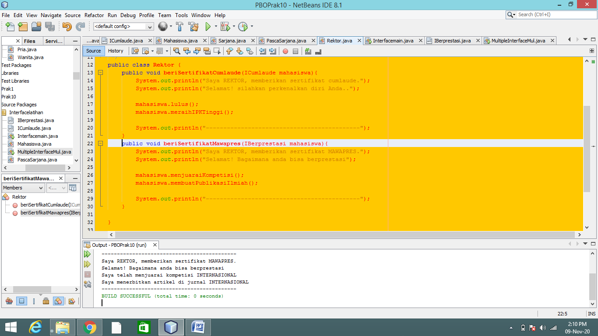

MARKDOWN

LAPORAN PRAKTIKUM

Percobaan 1

Percobaan 2

Pertanyaan

Percobaan 1

1.Pada langkah ke 9, pada baris program ke 3 terdapat warning pada script tersebut. 
Jelaskan penyebab terjadinya hal tersebut ?

Jawab : tersebut terjadi karena class interface ICumlaude yang berada pada satu package.

2.Pada langkah ke 9, pada baris program ke 3. Apa yang terjadi jika script tersebut 
dihilangkan? Jelaskan menurut pemahaman anda.

Jawab : Akan muncul build succesfull saja karena tidak ada instansiasi dari class yang dipanggil.

3.Mengapa pada langkah nomor 9 terjadi error? Jelaskan!

Jawab : Karena pada class mahasiswa belum melakukan implements ke class interface ICumlaude.

4.Dapatkah method kuliahDiKampus() dipanggil dari objek sarjanaCumlaude di class
Program? Mengapa demikian?

Jawab : Akan terjadi error, karena method kuliahDiKampus merupakan bagian dari class mahasiswa.

5.Dapatkah method kuliahDiKampus() dipanggil dari parameter mahasiswa di method 
beriSertifikatCumlaude() pada class Rektor? Mengapa demikian?

Jawab : tidak, karena bukan merupakan bagian dari implementasi, karena method tersebut berada dalam class mahasiswa bukan method dari hasil implementasi.

6.Modifikasilah method beriSertifikatCumlaude() pada class Rektor agar hasil eksekusi 
class Program menjadi seperti berikut ini:

Jawab : Menambahkan System.out.printlns pada class Sarjana dan PascaSarjana dengan value yang dinginkan di daerah method lulus.

Percobaan 2

1. Pada script code interface IBerprestasi, modifikasi script tersebut sesuai dengan gambar 
dibawah ini :(diubah menjadi protected)

Jawab : terjadi error karena tidak diperbolehkan dalam bentuk protected, karena jika menggunakan protected maka tidak dapat mengimplementasikan ke class yang lain.

2. Perhatikan script code dibawah ini :
Public static void main(String[] args)
	IBerprestasi prestasi = New IBerprestasi();
 Jelaskan menurut anda, mengapa hasil dari script code tersebut error ?

Jawab : Karena classnya berupa abstract sehingga tidak dapar diinstansiasikan ke dalam main.

3. Apabila Sarjana Berprestasi harus menjuarai kompetisi NASIONAL dan menerbitkan artikel di jurnal NASIONAL, 
maka modifikasilah class-class yang terkait pada aplikasi Anda agar di class Program objek pakRektor dapat 
memberikan sertifikat mawapres pada objek sarjanaCumlaude.

Jawab : 

TUGAS

