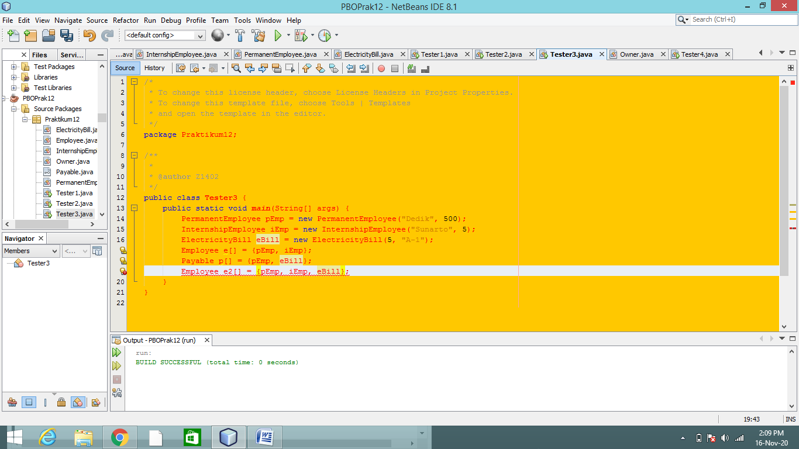

MARKDOWN 

LAPORAN PRAKTIKUM dan TUGA

Praktikum

Percobaan 1

Pertanyaan 

1.	Class apa sajakah yang merupakan turunan dari class Employee?

Jawab : InternshipEmployee dan PermanentEmployee

2.	Class apa sajakah yang implements ke interface Payable?

Jawab : PermanentEmployee dan ElectricityBill

3.	Perhatikan class Tester1, baris ke-10 dan 11. 
Mengapa e, bisa diisi dengan objek pEmp (merupakan objek dari class PermanentEmployee) 
dan objek iEmp (merupakan objek dari class InternshipEmploye) ?

Jawab : karena pEmp dan iEmp melakukan extends ke employee.

4.	Perhatikan class Tester1, baris ke-12 dan 13. 
Mengapa p, bisa diisi dengan objek pEmp (merupakan objek dari class PermanentEmployee) 
dan objek eBill (merupakan objek dari class ElectricityBill) ?

Jawab : karena pEmp dan eBill mengimplementasi dari interface Payable

5.	Coba tambahkan sintaks:
p = iEmp;
e = eBill;
pada baris 14 dan 15 (baris terakhir dalam method main) ! Apa yang menyebabkan error?

Jawab : Karena iEmp atau InternshipEmployee tidak mengimplements ke interface Payable, 
dan eBill tidak extends ke Employee sehingga kedua sintaks tersebut terjadi error.

6.	Ambil kesimpulan tentang konsep/bentuk dasar polimorfisme!

Jawab : Polimorfisme merupakan kemampuan suatu objek untuk memiliki banyak bentuk. Yaitu, ketika ada suatu objek yang dideklarasikan dari super class, 
maka objek tersebut bisa diinstansiasi sebagai objek dari sub class. Konsep polimorfisme bisa diterapkan pada class-class yang memiliki relasi inheritance (relasi generalisasi atau IS-A). 
Polimorfisme juga bisa diterapkan pada interface. Ketika ada objek yang dideklarasikan dari suatu interface, maka ia bisa digunakan untuk mereferensi ke objek dari class-class yang implements ke interface tersebut.

Percobaan 2

Pertanyaan

1.	Perhatikan class Tester2 di atas, mengapa pemanggilan e.getEmployeeInfo() pada baris 8 dan pEmp.getEmployeeInfo() pada baris 10 menghasilkan hasil sama?

Jawab : karena e dan pEmp merupakan intansiasi dari class Employee.

2.	Mengapa pemanggilan method e.getEmployeeInfo() disebut sebagai pemanggilan method virtual (virtual method invication), sedangkan pEmp.getEmployeeInfo() tidak?

Jawab : karena di e.getEmployeeInfo yang ada di class intershipEmployee terdapat polimorfisme yang ada di 
"String info = super.getEmployeeInfo()+"\n";
        info += "Registered as aintership employee for "+length+" month/s\n";"
        return info;
yang dimana pada method info ini ada polimorfisme yang mana jika dipanggil maka akan keluar sesuai dengan isi dari method tersebut.

3.	Jadi apakah yang dimaksud dari virtual method invocation? Mengapa disebut virtual?

Jawab : Virtual method invocation merupakan suatu hal yang sangat penting dalam konsep polimorfisme. Syarat terjadinya VMI adalah sebelumnya sudah terjadi polymorphism. 
Pada saat obyek yang sudah dibuat tersebut memanggil overridden method pada parent class, kompiler Java akan melakukan invocation (pemanggilan) terhadap overriding method pada subclass, dimana yang seharusnya dipanggil adalah overridden.

Percobaan 3

Pertanyaan

1.	Perhatikan array e pada baris ke-8, mengapa ia bisa diisi dengan objek-objek dengan tipe yang berbeda, 
yaitu objek pEmp (objek dari PermanentEmployee) dan objek iEmp (objek dari InternshipEmployee) ?

Jawab : karena pEmp dan iEmp merupakan bagian dari intansiasi dari class Employee.

2.	Perhatikan juga baris ke-9, mengapa array p juga biisi dengan objek-objek dengan tipe yang berbeda,
yaitu objek pEmp (objek dari PermanentEmployee) dan objek eBill (objek dari ElectricityBilling) ?

Jawab : karena pEmp dan eBill merupakan bagian dari implementasi dari interface Payable

3.	Perhatikan baris ke-10, mengapa terjadi error?

Jawab : karena eBill bukan termasuk dari instansiasi class Employee sehingga terjadi error.

Percobaan 4

Pertanyaan

1.	Perhatikan class Tester4 baris ke-7 dan baris ke-11, mengapa pemanggilan ow.pay(eBill) dan ow.pay(pEmp) bisa dilakukan, padahal jika diperhatikan method pay() yang ada di dalam class Owner memiliki argument/parameter bertipe Payable? 
Jika diperhatikan lebih detil eBill merupakan objek dari ElectricityBill dan pEmp merupakan objek dari PermanentEmployee?

Jawab : karena ada instanceof yang fungsinya untuk melalukan instansiasi dalam sebuah class, yang langsung dipanggil dari kelas yang diinginkan. 
Kemudian memanggil eBill dan pEmp yang tidak melakukan extends dan implemetnts di class owner karena adanya instanceof yang memanggil dari setiap masing-masing class yang ingin di munculkan diparameter.

2.	Jadi apakah tujuan membuat argument bertipe Payable pada method pay() yang ada di dalam class Owner?

Jawab : untuk menampung pembayaran yang dinginkan yang dimana dengan cara "instanceof" dari masing-masing kelas yang dinginkan untuk dipanggil dalam pengeksekusian.

3.	Coba pada baris terakhir method main() yang ada di dalam class Tester4 ditambahkan perintah ow.pay(iEmp); Mengapa terjadi error?

Jawab : karena class internshipEmployee tidak melakukan implements ke interface payable.

4.	Perhatikan class Owner, diperlukan untuk apakah sintaks p instanceof ElectricityBill pada baris ke-6 ?

Jawab : untuk memberikan casting pada instance of dari masing-masing 
argument class di method pay.

5.	Perhatikan kembali class Owner baris ke-7, untuk apakah casting objek disana (ElectricityBill eb = (ElectricityBill) p) diperlukan ? 
Mengapa objek p yang bertipe Payable harus di-casting ke dalam objek eb yang bertipe ElectricityBill ?

Jawab : agar instanceof terkait dengan objek eb dari ElectricityBill agar tahu ElecticityBill ini dari 
hasil instanceof karena jika tidak melakukan instanceof maka tidak akan bisa dan tidak akan terpanggil dimethodnya dan terjadi error.

TUGAS

