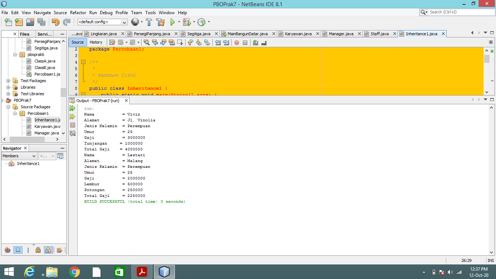
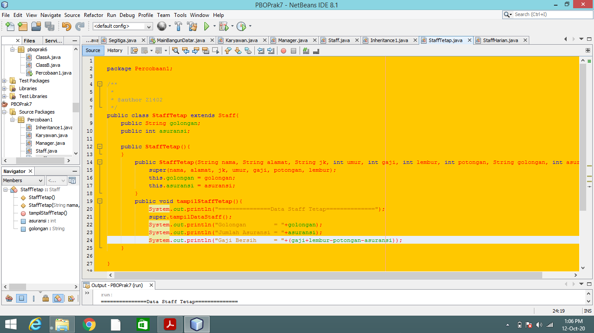
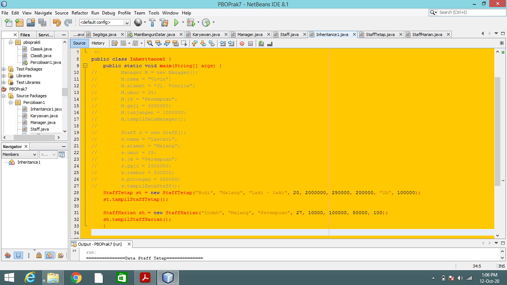
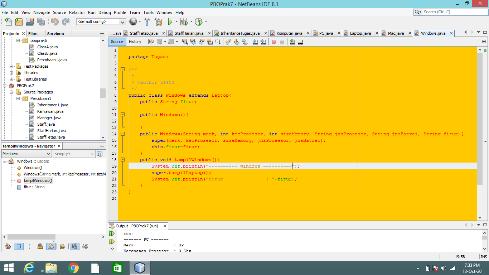
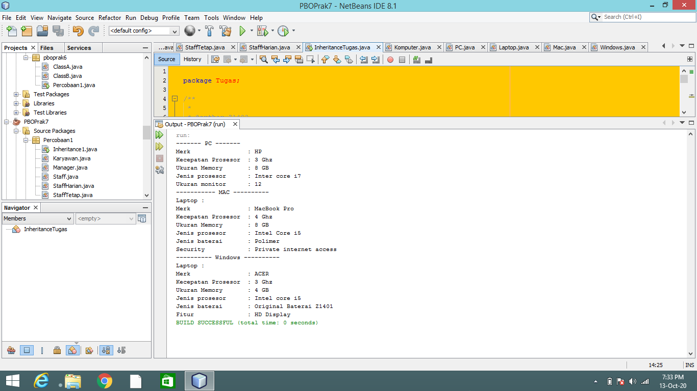

MARKDOWN LAPORAN PRAKTIKUM DAN TUGAS

Percobaan 1

1.	Sebutkan class mana yang termasuk super class dan sub class dari percobaan 1 diatas! 
Jawab : Super class yaitu karyawan, dan subclassnya yaitu manager dan staff.
2.	Kata kunci apakah yang digunakan untuk menurunkan suatu class ke class yang lain? 
Jawab : menggunakan kata kunci extends untuk mewarisi class lain.
3.	Perhatikan kode program pada class Manager, atribut apa saja yang dimiliki oleh class tersebut? Sebutkan atribut mana saja yang diwarisi dari class Karyawan! 
Jawab :Class manager hanya memiliki atribut tunjangan, dan class karyawan memiliki atribut gaji yang merupakan pewarisan dan memiliki super yang berartidiambil dari class super karyawan.
4.	Jelaskan kata kunci super pada potongan program dibawah ini yang terdapat pada class Manager! 
 [System.out.println("Total Gaji = "+(super.gaji+tunjangan);]
Jawab : atribut super tersebut diambil dari gaji yang terdapat di class karyawan, hal tersebut karena class karyawan di extends ke class manager.
5.	Program pada percobaan 1 diatas termasuk dalam jenis inheritance apa? Jelaskan alasannya!
Jawab : termasuk multilevel inheritance karena memiliki super hanya di class karyawan saja tidak di beberapa class.

Percobaan 2

1.	Berdasarkan class diatas manakah yang termasuk single inheritance dan mana yang termasuk multilevel inheritance? 
Jawab : yang termasuk dalam single class yaitu class staff, stafftetap, dan staffharian, sedangkan multilevel inheritance yaitu class yang mengextends dari class karyawan.
2.	Perhatikan kode program class StaffTetap dan StaffHarian, atribut apa saja yang dimiliki oleh class tersebut? Sebutkan atribut mana saja yang diwarisi dari class Staff! 
Jawab :class staff tetap memiliki atribut golongan dan asuransi, class staff harian memiliki atribut jumlah jam kerja, dan yang diwarisi class staff yaitu atribut lembur dan potongan.
3.	Apakah fungsi potongan program berikut pada class StaffHarian 
 [super(nama,alamat,jk,umur,gaji,lembur,potongan)]
Jawab : untuk memanggil atribut yang ada di class staff yang telah di extends di class staff harian dan agar tahu super atributnya berasal darimana yaitu dari konstruktor class staff sebagai class super.
4.	Apakah fungsi potongan program berikut pada class StaffHarian 
 [super.tampilDataStaff();]
Jawab : untuk menampilkan input yang nanti akan dikeluaran dari class staff , dan super menginisiasi dari class staff yang konstruktornya adalah nama, alamat, gaji, lembur, dan potongan.
5.	Perhatikan kode program dibawah ini yang terdapat pada class StaffTetap 
 [System.out.println("Gaji Bersih   ="+(gaji+lembur-potongan-asuransi));]
Terlihat dipotongan program diatas atribut gaji, lembur dan potongan dapat diakses langsung. Kenapa hal ini bisa terjadi dan bagaimana class StaffTetap memiliki atribut gaji, lembur, dan potongan padahal dalam class tersebut tidak dideklarasikan atribut gaji, lembur, dan potongan?
Jawab : Karena Class Staff sudah di extendskan dengan kelas Karyawan terlebih dahulu, dimana ada atribut gaji disitu lalu di Class Staff sudah ada atribut lembur dan potongan dan Class inheritance dari Class Staf yaitu Class StaffHarian dan ClassStafTetap itu kan sudah di extends kan dengan Class Staff maka akan bersambung dengan atribut yang sudah diextendskan dari kelas karyawan agar bisa dipakai dikelas yang dibutuhkan.

TUGAS

