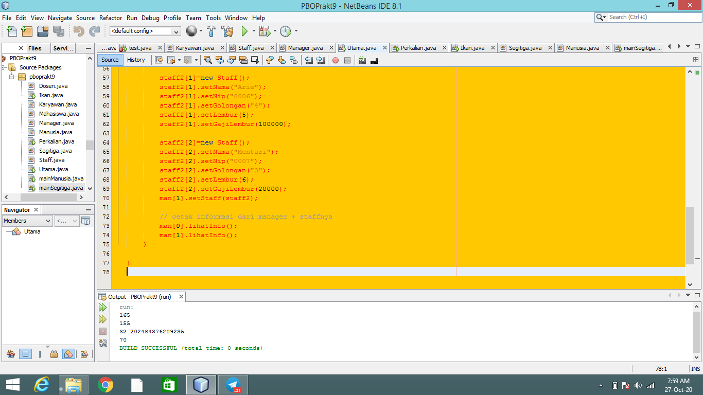
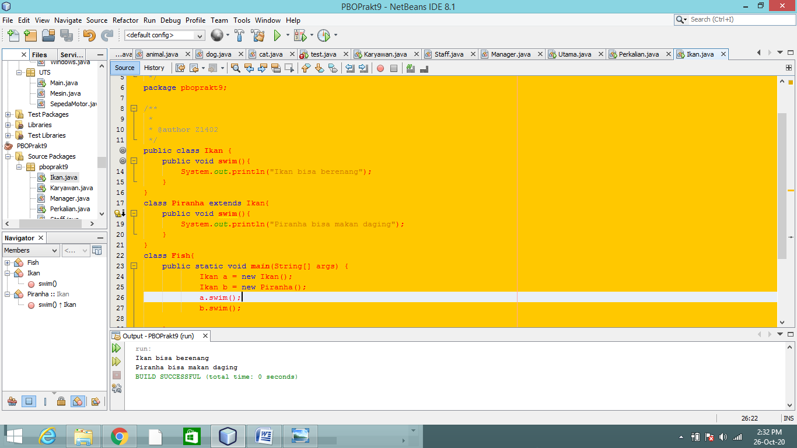
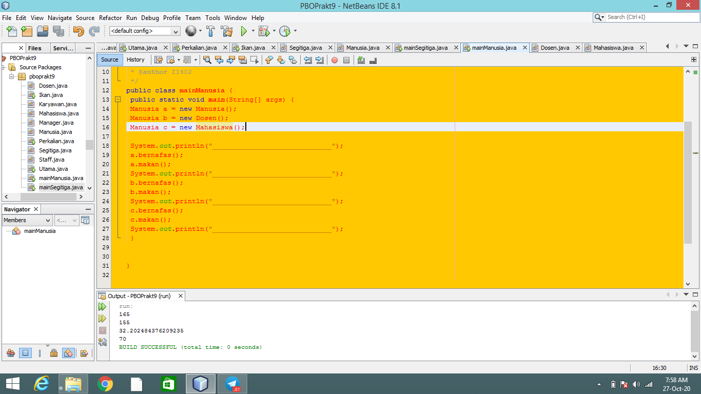

LAPORAN PRAKTIKUM

LATIHAN

1.	Dari source coding diatas terletak dimanakah overloading?

Jawab : pada baris ke 13  dan ke 16, memiliki 2 mothod yang sama namun memiliki parameter yang berbeda.

2.	Jika terdapat overloading ada berapa jumlah parameter yang berbeda?

Jawab : 1 parameter, yaitu int c.

3.	Dari source coding diatas terletak dimanakah overloading?

Jawab : pada barisan 13 dan 16, memiliki 2 mthod yagng sama namun memiliki parameter yang berbeda.

4.	Jika terdapat overloading ada berapa tipe parameter yang berbeda?

Jawab : 2 parameter yaitu menggunakan atribut double pada baris ke 16, yakni double a dan double b.

5.	Dari source coding diatas terletak dimanakah overriding?

Jawab : pada baris ke 14 dan ke 19, yakni method swim(), yang digunakan ppada subclass dengan mengubah inputan.

6.	Jabarkanlah apabila sourcoding diatas jika terdapat overriding?

Jawab : pada sourcoding nya memiliki method yang sama namun sifat yang berbeda yakni ikan bisa berenang dan sedangkan ikan piranha berenang dan pemakan daging.

TUGAS

NO 1 (Overloading)

NO 2 (Overriding)

